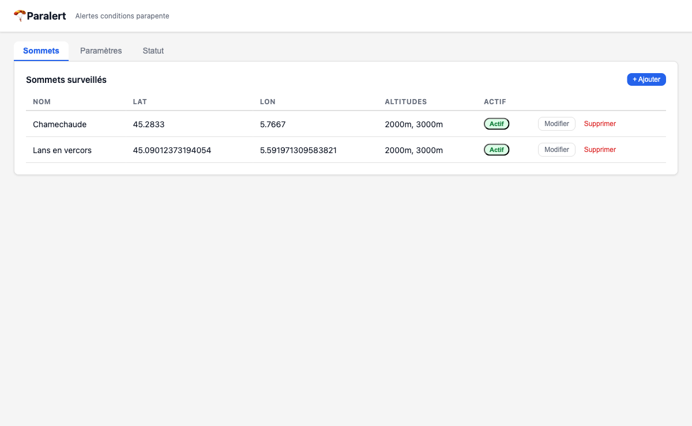

# paralert

Paragliding wind conditions alert tool. Monitors configured mountain summits via [Open-Meteo](https://open-meteo.com) and sends push notifications via [ntfy.sh](https://ntfy.sh) when wind is calm.



## What it does

- Checks wind speed at multiple altitudes (800/700/600 hPa) over 3-hour windows
- A window is **calm** when all hours at all configured altitudes are below the threshold
- Sends a daily push notification with calm windows grouped per summit
- Filters by season, solar window, cloud cover, and precipitation
- Runs on a configurable cron schedule (default: every morning)

## Stack

- **Python 3.12** + **uv**
- **FastAPI** + **SQLite** + **APScheduler**
- **Alpine.js** single-page UI (zero build step, served by FastAPI)
- **Hexagonal architecture** — domain, ports, adapters, use cases

## Quickstart

```bash
# Install and run (dev)
make

# Or with Docker
cp .env.example .env
docker compose up
```

UI available at `http://localhost:8080`.

## Configuration

### Environment variables

| Variable | Default | Description |
|----------|---------|-------------|
| `DB_PATH` | `/data/paralert.db` | SQLite database path |
| `HOST` | `0.0.0.0` | Server bind address |
| `PORT` | `8080` | Server port |

### App settings (via UI or API)

| Setting | Description |
|---------|-------------|
| `ntfy_url` | ntfy server URL (e.g. `https://ntfy.sh`) |
| `ntfy_topic` | ntfy topic to publish to |
| `wind_calm_kmh` | Wind speed threshold in km/h |
| `cron_expression` | APScheduler cron expression for daily check |
| `season_start/end` | Only check within season (`MM-DD` format) |
| `timezone` | Local timezone (e.g. `Europe/Paris`) |
| `cloud_cover_max_pct` | Max cloud cover % to consider conditions acceptable |
| `only_off_peak` | Restrict to solar window (sunrise → solar noon) |
| `custom_slots` | Override default 3-hour windows |

## API

```
GET  /api/summits/               List summits
POST /api/summits/               Add summit
PUT  /api/summits/{id}           Update summit
DEL  /api/summits/{id}           Delete summit
PATCH /api/summits/{id}/toggle   Enable/disable summit

GET  /api/settings/              Get app settings
PUT  /api/settings/              Update settings (reschedules cron)

POST /api/checks/now             Trigger manual check (async, 202)
GET  /api/checks/last            Get last check results per summit
```

## Tests

```bash
make test           # All tests
make test-unit      # Domain logic only (fast, no I/O)
make test-int       # SQLite + Open-Meteo adapters
make test-e2e       # API end-to-end
make test-front     # Playwright frontend tests
```

## Deployment

Home server via Docker Compose. Data persisted in `./data/paralert.db`.

```bash
docker compose up -d
```

## Altitude → pressure mapping

| Altitude | hPa |
|----------|-----|
| 2000 m   | 800 |
| 3000 m   | 700 |
| 4000 m   | 600 |
